# Отчёт по лабораторной работе 2 "Алгоритмы сопоставления изображений"

## 1. Теоретическая база

## 2. Описание разработанной системы

### Архитектура и алгоритмы

## 3. Результаты работы и тестирования системы

### Результаты тестирования:

[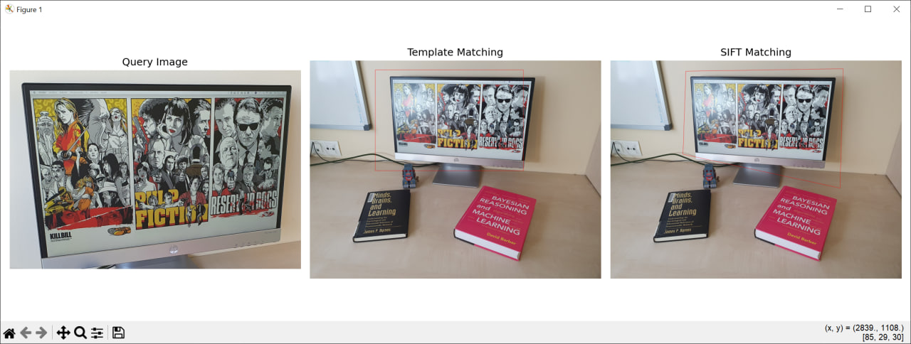](results/res1)
[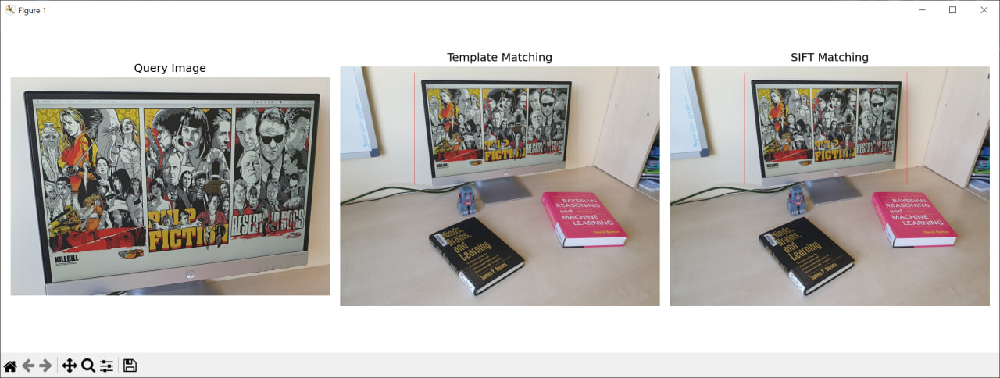](results/res2)
[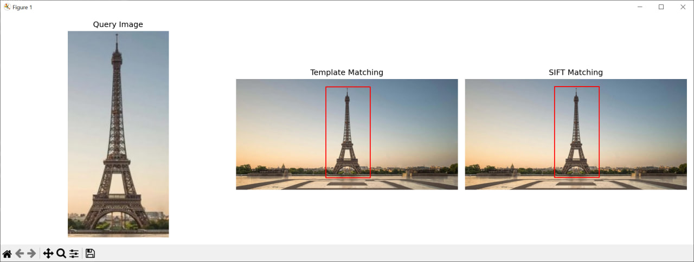](results/res3)
[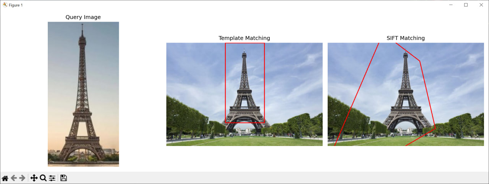](results/res4)
[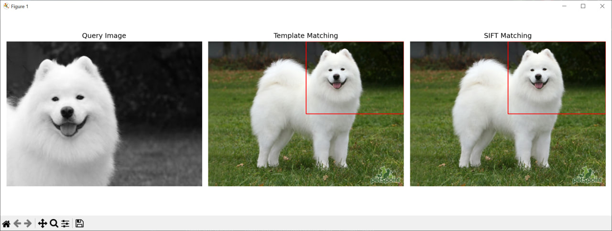](results/res5)
[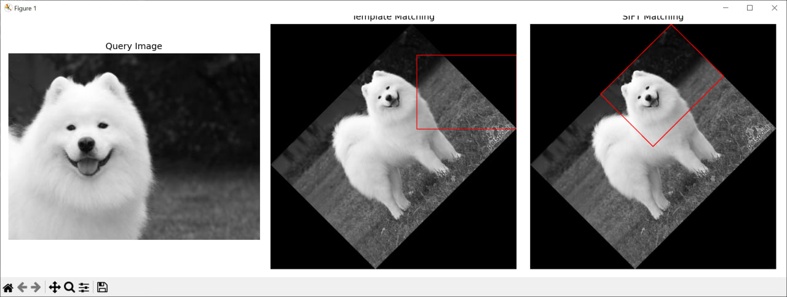](results/res6)
[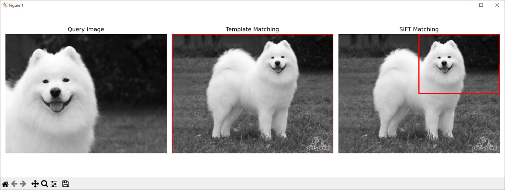](results/res7)
[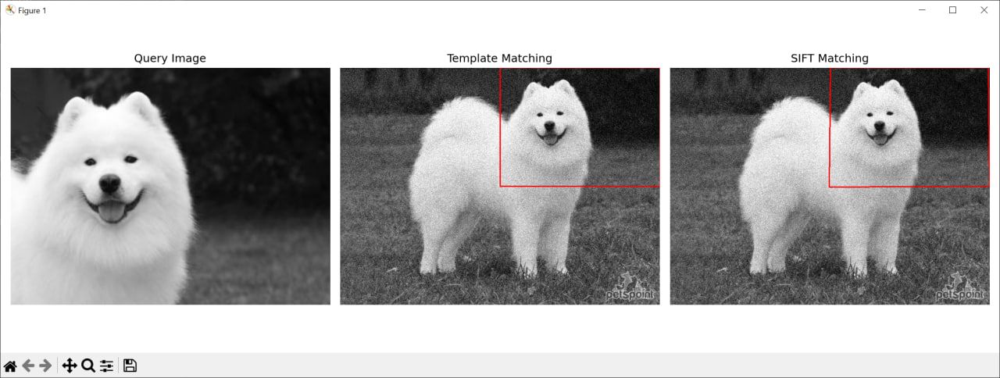](results/res8)
[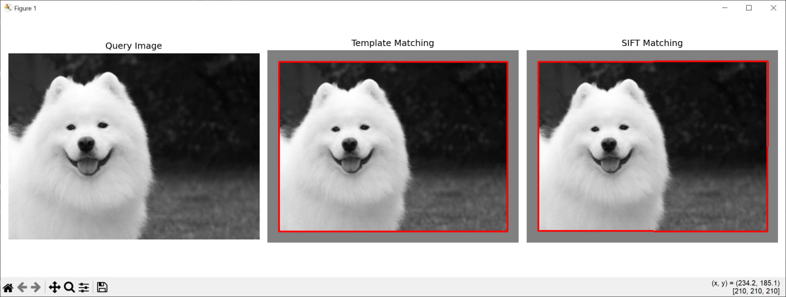](results/res9)
[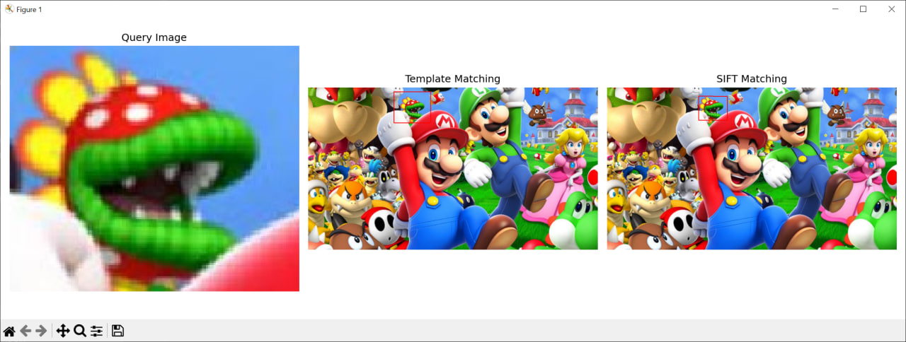](results/res10)
[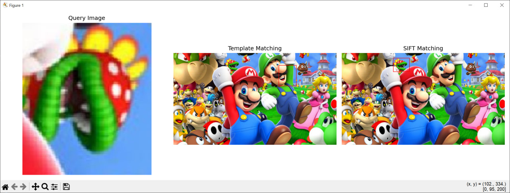](results/res11)
[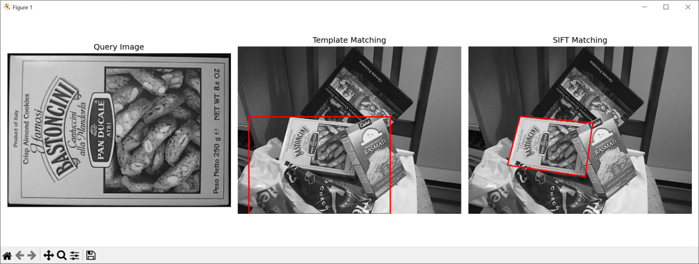](results/res12)
[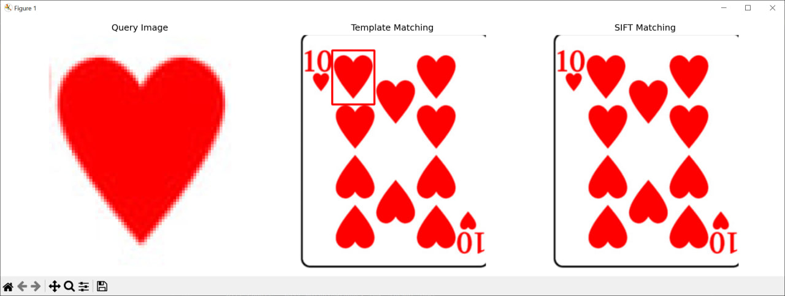](results/res13)

## 4. Выводы по работе

## 5. Использованные источники

- https://docs.opencv.org/4.x/d4/dc6/tutorial_py_template_matching.html
- https://docs.opencv.org/4.x/da/df5/tutorial_py_sift_intro.html
