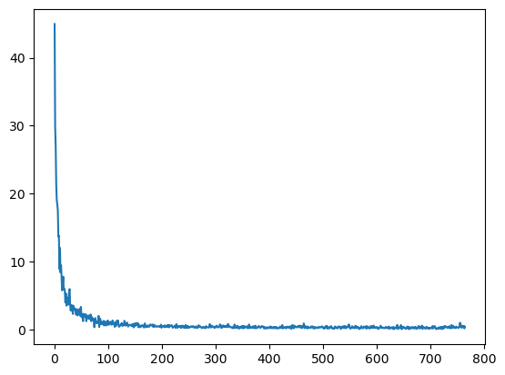

# Отчёт по лабораторной работе 3: Классификация изображений на основе сверточных нейронных сетей

## Цель работы
Научиться создавать простые системы классификации изображений на основе сверточных нейронных сетей (CNN).

---

## 1. Теоретическая база

Сверточные нейронные сети (CNN) — это специализированные модели машинного обучения, используемые для анализа изображений. Их ключевые компоненты:
- **Сверточные слои (Conv2D):** отвечают за выделение признаков (например, границы, текстуры).
- **MaxPooling:** уменьшает размерность признаков, сохраняя важные данные.
- **Полносвязные слои:** используют признаки для выполнения классификации.
- **Функции активации (ReLU, Leaky ReLU):** добавляют нелинейность в модель.
- **Softmax:** преобразует выходные значения в вероятности классов.

Метрики оценки модели:
- **F1-Score:** гармоническое среднее Precision и Recall.
- **Precision:** точность классификации (доля истинных положительных среди всех предсказанных положительных).
- **Recall:** полнота (доля истинных положительных среди всех реальных положительных).

---

## 2. Описание разработанной системы

### Датасет
Для задачи классификации использован датасет **MNIST** (содержит 10 классов изображений одежды). Датасет разделён на обучающую и тестовую выборки (60,000 и 10,000 изображений соответственно).

### Архитектура сети
Модель нейронной сети построена с использованием следующих слоев:
```python
model = NeuroModel(
    Conv2d(in_channels=1, kernels=4, kernel_size=(5,5), stride=(2,2), padding=(1,1)),
    Conv2d(in_channels=4, kernels=8, kernel_size=(5,5), stride=(1,1)),
    Conv2d(in_channels=32, kernels=2, kernel_size=(3,3), stride=(1,1)),
    Conv2d(in_channels=64, kernels=2, kernel_size=(3,3), stride=(1,1)),
    MaxPool(in_channels=128, kernel_size=(3,3), stride=(2,2)),
    Flatten(),
    Linear(input_neuron=512, output_neuron=256),
    LeackyRelu(),
    Linear(input_neuron=256, output_neuron=64),
    LeackyRelu(),
    Linear(input_neuron=64, output_neuron=10),
    Softmax(),
    lr=0.003
)
``` 

## 3. Результаты работы и тестирования системы

### Результаты тестирования:

1. **F1-Score**: 0.908
2. **Precision**: 0.915
3. **Recall**: 0.909

Модель успешно классифицировала тестовые изображения. Высокие значения F1-Score и Precision указывают на точность и надёжность классификации.

График обучения:
Потери (Loss): виден стабильный спад ошибки на обучающей и тестовой выборках.



## 4. Выводы по работе
1. Разработанная CNN модель успешно классифицирует изображения из датасета MNIST.
2. Высокие значения F1-Score, Precision и Recall подтверждают эффективность модели.

## 5. Использованные источники
1. MNIST Dataset. Kaggle.
2. Ian Goodfellow, et al. Deep Learning. MIT Press, 2016.
3. PyTorch Documentation: https://pytorch.org.
4. Towards Data Science Blog: "Understanding CNNs for Image Classification". https://towardsdatascience.com/